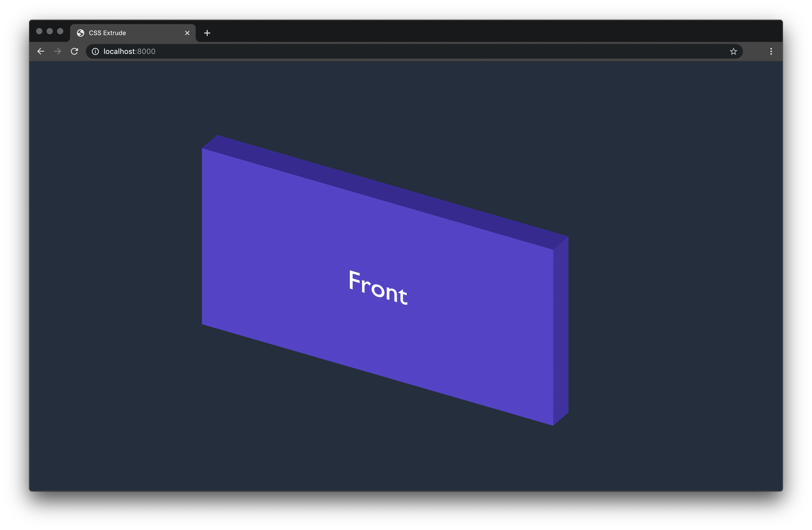
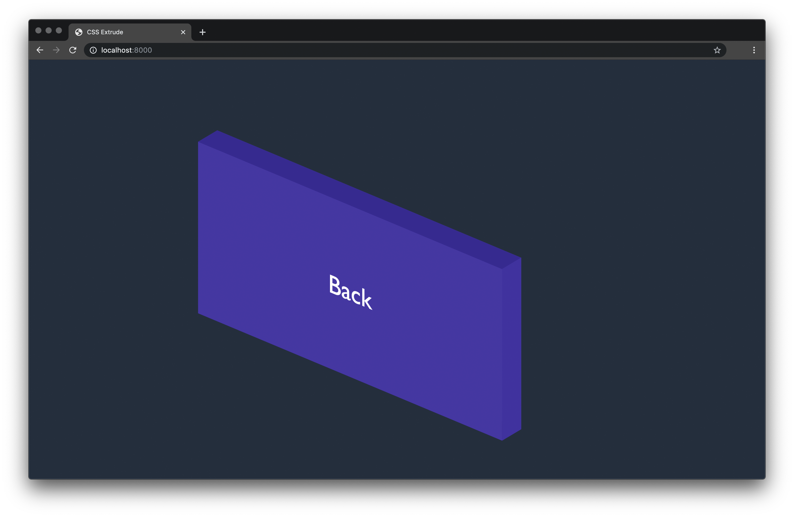

# CSS Extrude Rule Proposal

Proposal of the `CSS Extrude` Rule.

+ [Abstract](#abstract)
+ [Status Of This Document](#status-of-this-document)
+ [1. Introduction](#1-introduction)
+ [Notes](#notes)

## Abstract

The `CSS Space` module defines a three-dimensional layout system, optimized for user interface design. In the space layout model, the children of a space container can be positioned at a predefined spatial location.

## Status Of This Document

This document is NOT part of the current CSS standards and is merely a proposal, as implemented in the [`plurid`](https://github.com/plurid/plurid) framework.

The document is being written keeping an eye open on the formalization, practices, and discourse of the [CSS Specifications](https://www.w3.org/Style/CSS/specs.en.html).

## 1. Introduction

<i>This section is not normative.</i>

CSS Extrude is a rule for CSS that grants the abilities to create a 3D shape from the 2D element where it is applied.

CSS Extrude Cut is the reverse operation.

    
     
    30px extrusion

    
     
    rotated

    // Example 1

    // CSS
    #simple-extrude {
        height: 200px;
        width: 400px;
        background-color: slateblue; // the color of the front face
        extrude: 30px; // the depth of the extrusion
    }

    // HTML
    

    // Example 2

    // CSS
    #outer {
        height: 200px;
        width: 400px;
        background-color: slateblue;
        extrude: 20px;
    }

    #inner-1 {
        height: 30px;
        width: 50px;
        extrude-cut: through;
    }

    #inner-2 {
        height: 30px;
        width: 30px;
        extrude-cut: 10px;
    }

    // HTML
    

        

        

    

## Notes

See `./examples` for more details.
